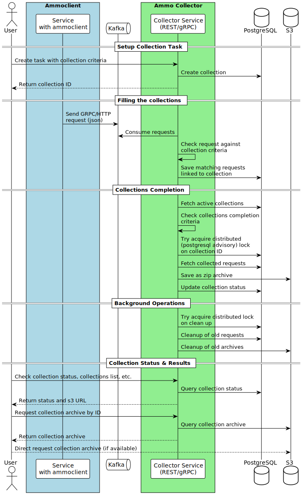

# Ammo Collector - HTTP and gRPC Request Content Collection Service

The Ammo Collector service is designed to capture and collect content from HTTP and gRPC requests based on user-defined criteria.
The service coordinates distributed request collection through Kafka, processing requests against user-defined criteria stored in PostgreSQL. Matching requests are aggregated into collections that automatically archive to S3 when completion conditions are met. Background maintenance tasks ensure resource cleanup while providing real-time collection status tracking and archive access via REST API or direct to S3.

<https://hub.docker.com/r/nrw2000/collector>

## Development status

*Early beta. Not recommended for production use*

TODO:

- Add the ability to automatically start collection on a schedule.
- Full test coverage
- More metrics

## Workflow



## Usage Requirements

- PostgreSQL 12+
- S3 compatible storage (minio, AWS S3, etc.)
- Apache Kafka 3.4+

## How To Build

### Build Requirements

- Go 1.23+
- Taskfile <https://taskfile.dev>

### Build

```bash
task build
```

## PostgreSQL initialization

### Requirements

- Goose Migration Tool <https://github.com/pressly/goose>

### Migration

```bash
task migrations-up
```

## Environment Variables

### Required Variables

- `AMMO_COLLECTOR_DATABASE_URL`: Database connection string (PostgreSQL)
- `AMMO_COLLECTOR_S3_ENDPOINT`: S3 storage endpoint
- `AMMO_COLLECTOR_S3_ACCESS_KEY`: S3 access key
- `AMMO_COLLECTOR_S3_SECRET_KEY`: S3 secret key
- `AMMO_COLLECTOR_S3_BUCKET`: S3 bucket name

### Optional Variables

#### Application Configuration

- `AMMO_COLLECTOR_SERVICE_NAME`: Service name (default: 'ammo-collector')
- `AMMO_COLLECTOR_LOG_LEVEL`: Logging level (DEBUG, INFO, WARN, ERROR) (default: 'INFO')
- `AMMO_COLLECTOR_ENV_TYPE`: Environment type (PROD, DEV) (default: 'DEV')

#### Server Configuration

- `AMMO_COLLECTOR_SERVER_HOST`: Server host (default: 'localhost')
- `AMMO_COLLECTOR_SHUTDOWN_TIMEOUT`: Graceful shutdown timeout (default: '30s')
- `AMMO_COLLECTOR_RECOVER_PANICS`: Enable panic recovery middleware (default: true)
- `AMMO_COLLECTOR_PROFILING_ENDPOINT`: pprof profiling endpoint
- `AMMO_COLLECTOR_METRICS_TYPE`: Metrics type (PROMETHEUS, OTEL) (default: 'PROMETHEUS')

#### GRPC Configuration

- `AMMO_COLLECTOR_GRPC_PORT`: gRPC server port (default: 8090)

#### HTTP Configuration

- `AMMO_COLLECTOR_HTTP_PORT`: HTTP server port (default: 8091)
- `AMMO_COLLECTOR_HTTP_READ_HEADER_TIMEOUT`: Time to read request headers (default: '10s')

#### Prometheus Configuration

- `AMMO_COLLECTOR_METRICS_PROMETHEUS_ENDPOINT`: Prometheus metrics endpoint (default: 'localhost:8092')

#### OTEL Configuration

- `AMMO_COLLECTOR_METRICS_OTEL_ENDPOINT`: OTEL metrics endpoint (default: 'localhost:4317')
- `AMMO_COLLECTOR_METRICS_OTEL_COLLECT_INTERVAL`: Metrics collection interval (default: '60s')
- `AMMO_COLLECTOR_METRICS_OTEL_MINIMUM_READ_MEM_STATS_INTERVAL`: Minimum memory stats read interval (default: '15s')
- `AMMO_COLLECTOR_METRICS_OTEL_CLIENT_CERT_FILE`: OTEL client certificate file
- `AMMO_COLLECTOR_METRICS_OTEL_CLIENT_KEY_FILE`: OTEL client key file
- `AMMO_COLLECTOR_METRICS_OTEL_ROOT_CA_FILE`: OTEL root CA file

#### Tracing Configuration

- `AMMO_COLLECTOR_TRACING_ENABLED`: Enable tracing (default: false)
- `AMMO_COLLECTOR_TRACING_ENDPOINT`: Tracing endpoint
- `AMMO_COLLECTOR_TRACING_SAMPLING_RATE`: Tracing sampling rate (default: 1.0)
- `AMMO_COLLECTOR_TRACING_TIMEOUT`: Tracing timeout (default: '10s')
- `AMMO_COLLECTOR_TRACING_EXPORTER`: Tracing exporter (OTLP-GRPC, OTLP-HTTP, ZIPKIN)
- `AMMO_COLLECTOR_TRACING_PROPAGATORS`: Tracing propagators (B3, JAEGER)
- `AMMO_COLLECTOR_TRACING_CLIENT_CERT_FILE`: Tracing client certificate file
- `AMMO_COLLECTOR_TRACING_CLIENT_KEY_FILE`: Tracing client key file
- `AMMO_COLLECTOR_TRACING_ROOT_CA_FILE`: Tracing root CA file

#### Kafka Configuration

- `AMMO_COLLECTOR_KAFKA_BROKERS`: Kafka brokers (default: 'localhost:9092')
- `AMMO_COLLECTOR_KAFKA_TOPIC`: Kafka topic (default: 'ammo-collector')
- `AMMO_COLLECTOR_KAFKA_GROUP_ID`: Kafka consumer group ID (default: 'ammo-collector')
- `AMMO_COLLECTOR_KAFKA_BATCH_SIZE`: Kafka batch size (default: 100)
- `AMMO_COLLECTOR_KAFKA_FLUSH_TIMEOUT`: Kafka flush timeout (default: '10s')

#### S3 Configuration

- `AMMO_COLLECTOR_S3_REGION`: S3 storage region (default: 'us-east-1')
- `AMMO_COLLECTOR_S3_MINIO_SUPPORT`: Enable MinIO support (default: true)
- `AMMO_COLLECTOR_S3_USE_PATH_STYLE`: Use path style for S3 (default: true)
- `AMMO_COLLECTOR_S3_READ_CHUNK_SIZE`: S3 read chunk size in bytes (default: 5242880)
- `AMMO_COLLECTOR_S3_WRITE_CHUNK_SIZE`: S3 write chunk size in bytes (default: 52428800)

#### Collection Configuration

- `AMMO_COLLECTOR_CACHE_UPDATE_INTERVAL`: Collection cache update interval (default: '10s')
- `AMMO_COLLECTOR_CACHE_UPDATE_INTERVAL_JITTER`: Cache update interval jitter (default: '1s')
- `AMMO_COLLECTOR_CLEANUP_INTERVAL`: Collection cleanup interval (default: '1h')
- `AMMO_COLLECTOR_CLEANUP_INTERVAL_JITTER`: Cleanup interval jitter (default: '1m')
- `AMMO_COLLECTOR_RETENTION_PERIOD`: Collection retention period (default: '168h')
- `AMMO_COLLECTOR_FINALIZER_INTERVAL`: Collection finalizer interval (default: '10s')
- `AMMO_COLLECTOR_FINALIZER_INTERVAL_JITTER`: Finalizer interval jitter (default: '1s')
- `AMMO_COLLECTOR_FINALIZER_CONCURRENCY`: Finalizer concurrency (default: 10)
- `AMMO_COLLECTOR_FINALIZER_MAX_COLLECTIONS`: Maximum collections to finalize per interval (default: 10)
- `AMMO_COLLECTOR_FINALIZER_RESULT_BATCH_SIZE`: Finalizer result batch size (default: 100)
- `AMMO_COLLECTOR_MAX_REQUESTS_PER_COLLECTION`: Maximum requests per collection (default: 10000)
